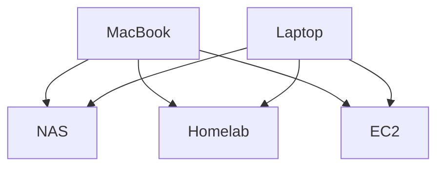

# dotfiles

English | [简体中文](README.zh-CN.md)

> My personal dotfiles repository for macOS and Linux. It uses [chezmoi](<https://github.com/twpayne/chezmoi>) to manage and deploy configuration files in a clean and maintainable way.

## Design

### How to manage files outside of the home directory?

According to [chezmoi's design](<https://www.chezmoi.io/user-guide/frequently-asked-questions/design/#can-i-use-chezmoi-to-manage-files-outside-my-home-directory>), `chezmoi` is primarily a user-scoped dotfiles manager. Files outside the user's home directory are therefore kept in this repository under a separate `root` source tree and deployed explicitly.

On Linux distributions other than NixOS, the executable template `home/dot_local/bin/executable_chezmoi-apply-root.tmpl` installs the external command `chezmoi-apply-root`. Running `chezmoi apply-root` starts a `chezmoi` process with `sudo`, using the following paths:

- `--source`: `{{ .chezmoi.workingTree }}/root`
- `--destination`: `/`

Consequently, paths are mapped directly to their system locations: `root/etc/...` becomes `/etc/...`, `root/root/...` becomes `/root/...`, and `root/usr/...` becomes `/usr/...`. These files are applied by `chezmoi`; they are not deployed as symlinks.

The root source tree is not applied by the regular `chezmoi apply` command. Its pending changes can be inspected with `chezmoi apply-root --dry-run --verbose` and applied explicitly with `chezmoi apply-root`.

### How to manage secrets and encrypted files?

#### About secrets

I initially encrypted every file containing private information. After using this setup for a while, I found that editing encrypted files was inconvenient. Secrets were also duplicated across files, so whenever I rotated a password, I had to update every file that used it individually.

To simplify this, I moved my passwords into the `[data]` section of `~/.config/chezmoi/chezmoi.toml`, referenced them from templates, and encrypted the entire configuration file. At the time, I did not know that `.chezmoi.toml.tmpl` existed. This left me with only one file to encrypt, made the secrets easier to manage, and allowed me to edit the other configuration files without decrypting them first.

However, this introduced another problem: `chezmoi apply` loaded its configuration at startup. Even when it deployed an updated configuration file during that run, the process continued using the data it had loaded beforehand. After I changed or added a password, templates could therefore use an outdated value or fail because the new value was missing. I had to run `chezmoi apply` a second time to get the correct result.

I opened an issue asking whether the configuration file could be applied first, and that was how I learned about `.chezmoi.toml.tmpl`. Eventually, I moved my entire `chezmoi` configuration into that template. For sensitive data, I decided to use a password manager. But which one?

To choose a suitable password manager, I first identified two categories of secrets with different requirements:

- **Everyday credentials**, such as website logins:
    - Rarely used in the CLI.
    - Need seamless password autofill and generation.
    - Need to be available across multiple devices, including phones.
- **Development and infrastructure secrets**, such as API keys, access tokens, and SSH private keys:
    - Rarely used outside of the CLI.
    - Only need to support my desktop and command-line workflow; mobile clients are unnecessary.

`1Password` could potentially handle both categories, but its subscription cost and integration with Safari and iPhone do not meet my expectations for this workflow. In particular, I want a consistent experience when entering credentials in system interfaces such as Settings and the App Store. I therefore use two tools:

- **[Passwords](<https://apps.apple.com/us/app/passwords/id6473799789>)** for everyday credentials, with native integration across my Apple devices.
- **[gopass](<https://www.gopass.pw>)** for development and infrastructure secrets, where command-line access matters most.

`gopass` also provides the encrypted secret store for my `chezmoi`-managed dotfiles. Templates retrieve shared secrets from `gopass`, keeping sensitive values encrypted in the store rather than duplicating them across source files.

`chezmoi` uses `age` for encrypted files. This repository currently contains no `chezmoi`-encrypted files, so the `[age]` identity and recipients settings are commented out; the SSH key paths remain as examples for future use. These settings are independent of `gopass`: before the first apply on a root node, import an existing native `age` identity with `gopass age identities add`, or generate one with `gopass age identities keygen`. `gopass` keeps it in its encrypted keyring at `~/.config/gopass/age/identities`. A newly generated identity must also be added as a recipient and the existing secrets re-encrypted on a device that can already decrypt the store. Leaf nodes use `~/.ssh/id_ed25519` instead.

#### About device identity

My workflow also distinguishes between two roles in the SSH connection topology. Here, *root* describes a device's role in that topology, not the Unix `root` account.

- **Root nodes** are typically laptops:
    - Frequently initiate SSH connections to leaf nodes and are rarely accessed as SSH servers.
    - Usually support biometric authentication, such as Touch ID.
- **Leaf nodes** are typically desktop computers, home servers, NAS devices, or cloud servers:
    - Frequently receive SSH connections, although they may also initiate them.
    - Have limited biometric authentication support, especially during remote access.

These different roles call for different decryption and synchronization settings. The `meta.isRootNode` setting selects the role and its `gopass` configuration:

- **Root nodes** use dedicated `age` identities for decryption. A native `age` private key is the baseline; where supported, plugin-backed identities can integrate with biometric authentication or hardware tokens, such as [Apple's Secure Enclave](https://github.com/remko/age-plugin-se) or [YubiKey](https://github.com/str4d/age-plugin-yubikey). These capabilities require the corresponding plugins rather than a plain `age` private key alone.
  `gopass` enables `core.autopush` and `core.autosync` on these nodes, allowing bidirectional synchronization.
- **Leaf nodes** use their existing SSH private keys for decryption through [age's SSH key support](https://github.com/FiloSottile/age#ssh-keys), simplifying initial setup and reducing the number of keys I need to maintain.
  `gopass` disables both `core.autopush` and `core.autosync` on these nodes. The `chezmoi` pull script retrieves updates with `gopass --yes --nosync git -- pull --ff-only`, without pushing or creating merge commits. It fails if the local and remote histories have diverged.

`gopass sync` performs a Git pull followed by a push; its pull does not explicitly use `--ff-only`. Disabling `core.autopush` stops automatic pushes after local changes, while disabling `core.autosync` stops automatic bidirectional sync. Neither setting prevents an explicit `gopass sync`, so leaf nodes use the pull command above for updates. The same `chezmoi` pull script also runs on root nodes.

In my own setup, I never need to SSH into root nodes. Each node maintains one identity for secret-store decryption: a native `age` identity on root nodes, or an existing SSH key on leaf nodes. SSH login uses a separate client identity: Mac root nodes use [Secretive](https://github.com/maxgoedjen/secretive) to keep their login private keys in the Secure Enclave, while other clients can use locally retained SSH private keys.

#### About initialization and authorization

- **Leaf nodes** first generate an SSH key pair and submit only the public key to a root node. The root node runs `gopass recipients add` to add that public key as a recipient and re-encrypt the store. Once the leaf node pulls the updated store, it can decrypt the secrets with its locally retained SSH private key. Both halves of the key pair remain on the leaf node; the private key does not need to be transferred for authorization.
- **Root nodes** bootstrap access to the `gopass` store using the recovery key stored on a physical security key. With that initial decryption capability, a root node can authorize its own native `age` identity as a recipient and re-encrypt the store, then use that identity for everyday access.

On `chezmoi`-managed leaf nodes, `home/dot_ssh/authorized_keys.tmpl` generates `~/.ssh/authorized_keys` as a regular file. It includes the leaf node's own `id_ed25519.pub` and the root client public keys listed in `home/.chezmoidata/rootNodeIdentities.toml`. NixOS currently excludes `.ssh` from `chezmoi` management.

Mac root nodes authenticate through `Secretive`'s SSH agent using their own login keys. Their public keys are deployed to leaf nodes through `chezmoi`; their private keys cannot be exported and are not distributed through `gopass`. The leaf's Ed25519 private key stays on the leaf for `gopass` decryption, so root clients no longer need a copy of it to log in.

SSH login authorization and secret-store decryption authorization are maintained separately: root client public keys in `authorized_keys` grant login access, while `gopass` recipients grant decryption access. Removing an SSH login key does not revoke secret-store access. The leaf's own public key remains in `authorized_keys`, so a client that still holds its private key can also authenticate. These user keys are separate from the SSH server's host keys.

In this workflow, a leaf node submits its “identity,” and a root node “authorizes” it. A leaf node that can already decrypt and modify the store could technically re-encrypt it for another recipient, but my policy is to perform all new-node authorizations on root nodes. This is a workflow convention, not a restriction enforced by `age` encryption.

### How to manage dotfiles on NixOS?

NixOS is a unique Linux distribution that uses reproducible configuration to manage the system. `Home Manager` provides Nix modules for managing user environments, including dotfiles. However, given the following drawbacks, I decided to keep using `chezmoi` on NixOS:

1. Not all packages have corresponding `Home Manager` modules. Managing some configurations through modules and others manually can make the workflow feel inconsistent.
2. Using `Home Manager` as my only package manager would require installing Nix first on other Linux distributions, such as Arch and Fedora. Maintaining two package management workflows is also inconvenient.

I therefore use `Home Manager` only to manage which packages are installed, while `chezmoi` manages my dotfiles. Since NixOS is declarative, I also avoid `run_*` scripts for system setup on NixOS and use declarative NixOS or `Home Manager` configuration instead.
