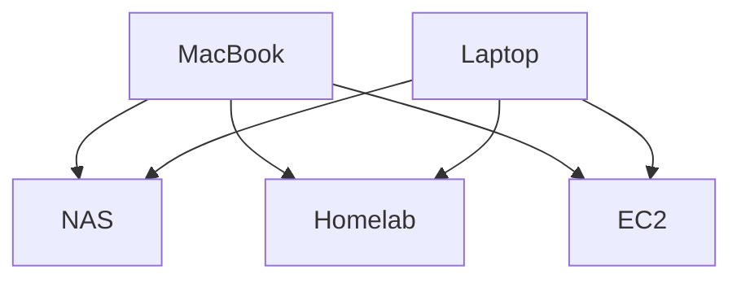

# dotfiles

[English](README.md) | 简体中文

> 我的个人 dotfiles 仓库，适用于 macOS 和 Linux。使用 [chezmoi](https://github.com/twpayne/chezmoi) 管理和部署配置文件，让配置保持清晰、易于维护。

## 设计

### 如何管理家目录之外的文件？

根据 [chezmoi 的设计原则](https://www.chezmoi.io/user-guide/frequently-asked-questions/design/#can-i-use-chezmoi-to-manage-files-outside-my-home-directory)，`chezmoi` 主要用于管理用户级的 dotfiles。因此，家目录之外的文件存放在仓库中独立的 `root` 源目录下，并通过专门的命令部署。

在 NixOS 之外的 Linux 发行版上，可执行模板 `home/dot_local/bin/executable_chezmoi-apply-root.tmpl` 会安装外部命令 `chezmoi-apply-root`。运行 `chezmoi apply-root` 时，该命令通过 `sudo` 启动一个 `chezmoi` 进程，使用以下路径：

- `--source`：`{{ .chezmoi.workingTree }}/root`
- `--destination`：`/`

因此，文件路径会直接映射到系统中的对应位置：`root/etc/...` 对应 `/etc/...`，`root/root/...` 对应 `/root/...`，`root/usr/...` 对应 `/usr/...`。这些文件由 `chezmoi` 部署，不使用符号链接。

常规的 `chezmoi apply` 不会部署 `root` 源目录中的文件。可以先运行 `chezmoi apply-root --dry-run --verbose` 查看待应用的变更，再通过 `chezmoi apply-root` 显式部署。

### 如何管理敏感信息和加密文件？

#### 关于敏感信息

最初，我会加密所有包含隐私信息的文件。使用一段时间后，我发现编辑加密文件并不方便。另外，同一份敏感信息会重复保存在多个文件中，每次轮换密码，都需要逐个修改使用它的文件。

为了简化维护，我将密码集中保存在 `~/.config/chezmoi/chezmoi.toml` 的 `[data]` 中，通过模板引用，并加密整个配置文件。当时，我还不知道 `.chezmoi.toml.tmpl` 的存在。这样只需加密一个文件，敏感信息也更容易管理，其他配置文件则可以直接编辑，无需先解密。

不过，这引入了另一个问题：`chezmoi apply` 会在进程启动时读取配置。即使它在本次运行中部署了更新后的配置文件，进程仍会使用启动时读取的数据。因此，修改或新增密码后，模板可能继续使用旧值，或因缺少新增的值而报错。我需要再次运行 `chezmoi apply`，才能得到正确的结果。

我曾为此提出 issue，希望能优先应用配置文件，也正是在那时得知了 `.chezmoi.toml.tmpl` 的存在。后来，我将全部 `chezmoi` 配置迁移到这个模板中。至于敏感信息，我决定交给密码管理工具。但该选哪一个？

为了选择合适的密码管理工具，我先将敏感信息分为两类，明确各自的需求：

- **日常登录凭据**，例如各个网站的登录密码：
    - 很少在命令行中使用。
    - 需要无缝集成密码自动填充和生成。
    - 需要在包括手机在内的多个设备上使用。
- **开发与基础设施凭据**，例如 API 密钥、访问令牌和 SSH 私钥：
    - 很少在命令行之外使用。
    - 只需满足桌面环境和命令行工作流，无需移动端支持。

`1Password` 或许可以同时满足这两类需求，但它的订阅费用，以及与 Safari、iPhone 的集成体验，并不符合我对这套工作流的期望。尤其是在系统设置、App Store 等系统界面中输入凭据时，我希望获得一致、顺畅的体验。因此，我选择用两个工具分别管理这两类密码库：

- **[Passwords（密码）](https://apps.apple.com/us/app/passwords/id6473799789)**：保存日常登录凭据，利用 Apple 设备之间的原生集成。
- **[gopass](https://www.gopass.pw)**：保存开发与基础设施凭据，优先满足命令行访问需求。

`gopass` 同时作为 `chezmoi` 所管理的 dotfiles 的加密秘密存储。模板从 `gopass` 中读取共享的敏感信息，使这些值以加密形式保存在密码库中，避免在多个源文件中重复保存。

`chezmoi` 使用 `age` 处理加密文件。仓库目前没有 `chezmoi` 加密文件，因此 `[age]` 的 identity 和 recipients 设置已注释，保留 SSH 密钥路径作为未来使用的示例。这些设置独立于 `gopass`：root 节点首次 apply 前，可通过 `gopass age identities add` 导入已有的原生 `age` identity，或通过 `gopass age identities keygen` 生成一个。`gopass` 会将其保存在 `~/.config/gopass/age/identities` 加密密钥库中。新生成的 identity 还需要在能够解密现有密码库的设备上加入 recipient 列表，并重新加密已有秘密。Leaf 节点则使用 `~/.ssh/id_ed25519`。

#### 关于设备身份

在我的工作流中，设备还可以根据 SSH 连接拓扑中的角色分为两类。这里的 *root* 指设备在连接拓扑中的角色，与 Unix 的 `root` 账户无关。

- **Root 节点**通常是笔记本电脑：
    - 经常主动通过 SSH 连接 leaf 节点，很少作为 SSH 服务端被访问。
    - 通常支持 Touch ID 等生物识别认证。
- **Leaf 节点**通常是桌面电脑、家庭服务器、NAS 或云服务器：
    - 经常作为 SSH 服务端被访问，也可以主动发起 SSH 连接。
    - 对生物识别认证的支持有限，尤其是在远程访问时。

这两类设备的使用方式不同，因此，我为它们选择了不同的解密和同步策略，通过 `meta.isRootNode` 设置选择节点角色及对应的 `gopass` 配置：

- **Root 节点**使用专门的 `age` 身份进行解密。以原生 `age` 私钥为基础；在支持的环境中，也可以使用插件提供的身份，结合生物识别认证或硬件令牌，例如 [Apple Secure Enclave](https://github.com/remko/age-plugin-se) 或 [YubiKey](https://github.com/str4d/age-plugin-yubikey)。这些能力需要相应插件，并非普通 `age` 私钥本身就能提供。
  `gopass` 启用 `core.autopush` 和 `core.autosync`，允许双向同步。
- **Leaf 节点**通过 [age 对 SSH 密钥的支持](https://github.com/FiloSottile/age#ssh-keys)，使用已有的 SSH 私钥解密，以简化初始化流程，减少需要维护的密钥数量。
  `gopass` 关闭 `core.autopush` 和 `core.autosync`。`chezmoi` 的 pull 脚本通过 `gopass --yes --nosync git -- pull --ff-only` 拉取更新，不推送，也不创建合并提交；本地与远端历史分叉时会失败。

`gopass sync` 会先执行 Git pull，再执行 push，其中 pull 没有显式指定 `--ff-only`。关闭 `core.autopush` 只会停止本地修改后的自动推送，关闭 `core.autosync` 则停止自动双向同步；两者都不会阻止显式运行 `gopass sync`。因此，leaf 节点使用上述 pull 命令更新。Root 节点也会运行同一个 `chezmoi` pull 脚本。

在我的实际使用中，我没有通过 SSH 访问 root 节点的需求。每个节点维护一个用于密码库解密的 identity：root 节点使用原生 `age` identity，leaf 节点复用已有的 SSH 密钥。SSH 登录使用独立的客户端身份：Mac root 节点通过 [Secretive](https://github.com/maxgoedjen/secretive) 将登录私钥保存在 Secure Enclave 中，其他客户端可以使用保留在本机的 SSH 私钥。

#### 关于初始化与授权

- **Leaf 节点**首先生成 SSH 密钥对，只将公钥提交给 root 节点。Root 节点运行 `gopass recipients add`，将该公钥加入 recipient 列表，并重新加密密码库。Leaf 节点拉取更新后的密码库，即可使用保留在本地的 SSH 私钥解密。公钥和私钥都保存在 leaf 节点上，授权过程无需传输私钥。
- **Root 节点**使用保存在物理安全密钥中的 recovery 密钥，获得 `gopass` 密码库的初始解密权限。获得这一能力后，再将自身的原生 `age` identity 对应的 recipient 加入密码库并重新加密，之后使用该 identity 进行日常访问。

对于由 `chezmoi` 管理 SSH 配置的 leaf 节点，`home/dot_ssh/authorized_keys.tmpl` 会将 `~/.ssh/authorized_keys` 生成为普通文件，内容包括 leaf 本机的 `id_ed25519.pub`，以及 `home/.chezmoidata/rootNodeIdentities.toml` 中登记的 root 客户端公钥。NixOS 当前将 `.ssh` 排除在 `chezmoi` 管理范围之外。

Mac root 节点通过 `Secretive` 的 SSH 代理，使用自己的登录密钥认证。公钥由 `chezmoi` 部署到 leaf 节点；私钥无法导出，也不通过 `gopass` 分发。Leaf 的 Ed25519 私钥保留在 leaf 本机，用于 `gopass` 解密，root 客户端无需取得它的副本即可登录。

SSH 登录授权与密码库解密授权分别维护：`authorized_keys` 中的 root 客户端公钥授予登录权限，`gopass` recipients 授予解密权限。移除 SSH 登录公钥不会撤销密码库访问权限。由于授权文件仍保留 leaf 自身的公钥，仍持有对应私钥的客户端也可以登录。这些用户密钥与 SSH 服务端的 host key 相互独立。

可以将这套流程理解为：leaf 节点提交“身份”，root 节点“授权”身份。已经能够解密并修改密码库的 leaf 节点，在技术上也可以为新的 recipient 重新加密密码库，但我的原则是统一由 root 节点授权新节点。这是工作流约定，并非 `age` 加密机制强制施加的权限限制。

### 如何在 NixOS 上管理 dotfiles？

NixOS 是一个独特的 Linux 发行版，使用可复现的配置管理系统。`Home Manager` 提供用于管理用户环境的 Nix 模块，也涵盖 dotfiles。不过，考虑到以下问题，我仍然选择在 NixOS 上使用 `chezmoi`：

1. 并非所有软件包都有对应的 `Home Manager` 模块。一部分配置通过模块管理，另一部分手动管理，容易让工作流产生割裂感。
2. 如果只使用 `Home Manager` 管理软件包，就需要先在 Arch、Fedora 等其他 Linux 发行版上安装 Nix。维护两套软件包管理工作流也不方便。

因此，我只用 `Home Manager` 管理需要安装的软件包，dotfiles 仍由 `chezmoi` 管理。另外，NixOS 采用声明式配置，我会避免通过 `run_*` 脚本进行系统初始化，而是使用声明式的 NixOS 或 `Home Manager` 配置。
